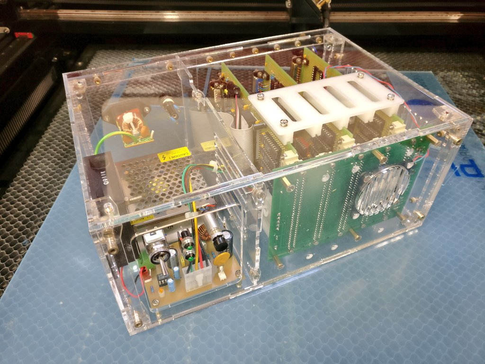

# Micro Z180 homebrew computer

*This is my attempt to create a 80's style computer based on the Zilog Z180 CPU.*

**All the software is GPL v2, and all the hardware is CC-BY-NC-SA**

The goal is to build from scratch a complete computer, with  keyboard, video display, and mass storage. The software will be Microsoft BASIC and CP/M. Think of it as a crossover between an Amstrad CPC and an IBM PC 5150 !

The computer is designed around STEBUS, which is an old but well designed 8-bits industry-standard bus (https://en.wikipedia.org/wiki/STEbus). 

For now there are 5 cards :

 * PSU : the power supply, which takes 12v as input and generates +5v and -12v 
 * BUS : the STEBUS base board, with 5 slots and active termination
 * CPU : The main CPU board, with 2 RS-232 connectors
 * VDU : Video display unit, VGA text-only 80x25 with 16 colors, and 8 fonts selectable via jumpers on the board
 * MIO : Multi I/O, including PS/2 keyboard, Real time clock, Sound , Compact flash and Parallel port
 
 There are 3 main folders in this reposirory :
 
 * enclosure : all the files needed to build the case, which is laser_cut 3mm transparent acrylic (all parts are smaller than 200x300 mm), with a 3D printed part to mechanicaly guide the boards.
 * hardware : the description of all boards (very incomplete for now !)
 * software : Tests, BIOS, BASIC, and CP/M (coming soon !)
 
 ## Status of the computer
 
 **This is a work-in-progress !**
 
 For now the computer is running BASIC with the PS/2 keyboard and integrated video display. There are still some rough edges but we are almost here.
 
 Some files are not yet on the repository because the computer was designed with paper and pencil ! 
 
 
 
